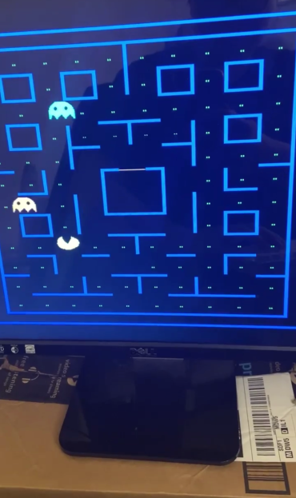

<h1 align="center"> Pacman </h1>
Implemented the game Pacman using SystemVerilog and the FPGA (DE10-Lite) for ECE385 Final Project. To win, the Pacman has to eat all the pellets without running into the ghosts and the user can play with W,A,S,D as the arrow keys.

## Game Display ##

## Compiling the Project ##
1. You will need a physical copy of DE10-Lite board
2. Download and install Quartus
  * For Windows and on Linux (Recommended)
    * Download Quartus Prime Lite Edition, Device Support for MAX 10, and ModelSim Intel FPGA Edition at [Quartus Prime (18.1)](https://fpgasoftware.intel.com/?edition=lite)
  * For MacOS
    * Download [Quartus (18.1) on Ubuntu 19.04 VM](https://uofi.app.box.com/s/rnv20n2fk5tkefhxkbiawofwuxsqypsw)
    * Download [Virtual Box and Extensions](https://www.virtualbox.org/wiki/Downloads)
3. Download the codes and make sure lab8.sv is set up as the top level
4. Click **Start Compilation**
5. Select the hardware using auto detect and load in the sof file
6. Finally, click the **Start** button
